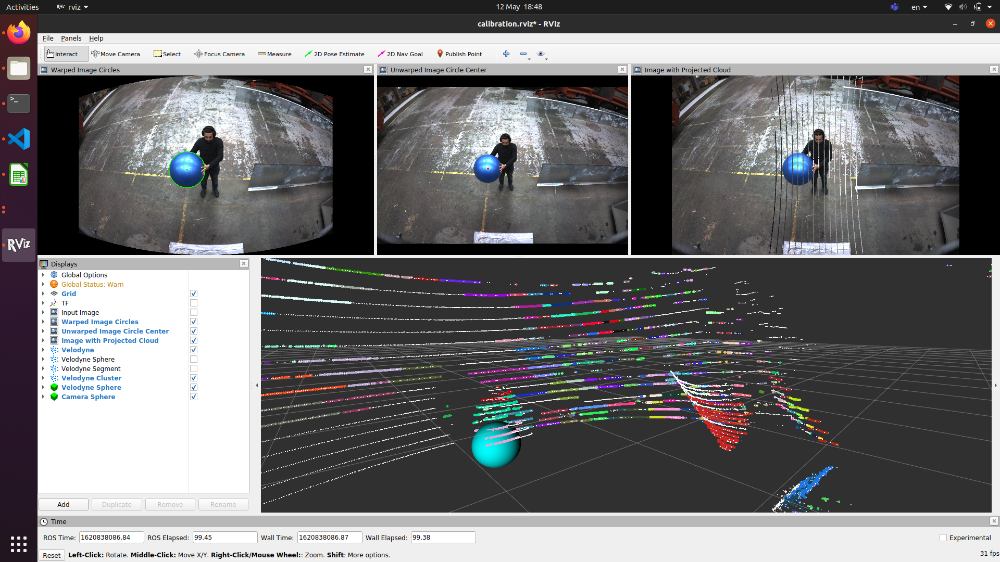
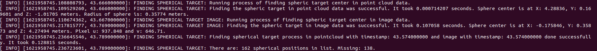
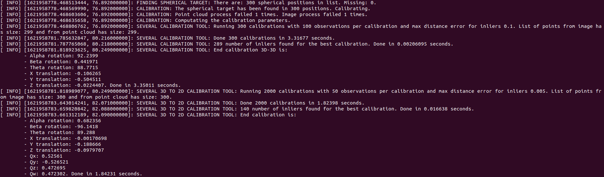

# Calibration Method

This repository intends to calibration a LiDAR and a monocular camera by moving a spherical target in front of the sensors. This target looks as shown in the image below. The calibration can be done in three different ways:

1. **Calibration process in real life:** it will connect to the data from the sensors in real life and has parameters needed for the real life environment. This setup is used for calibrating the two sensors in real life.
2. **Calibration simulation:** it will start a simulation world with two sensors and a spherical target moving. It will connect to the two sensor's data and has parameters needed for the simulation environment. This setup can be used to check that the calibration process works properly. Each sensor setup (position of sensors and vehicle would be different) needs to be created independently. At 25th of May of 2021, only three different setups have been created.
3. **Ideal calibration simulation:** it will start a simulation world with two sensors and a spherical target moving. It will obtain the exact position of the target from the two sensors and calibrate the sensors. This setup can be used to check how the path that the spherical target moves on as well as the time synchronization error affects the accuracy.


---

## Installation

For this program to work, ceres needs to be installed. The tags 1.14 and 2.0 can be installed from this repository: . Follow these instructions: .

---

## How to run the program

To run the program, these commands need to be run in the terminal for the different methods mentioned above:

1. **Calibration process in real life:** A parameter that can be added is *ethRect* which can define if the image to process should be rectified with the code implemented by ETH.
```bash
roslaunch calibration calibrate.launch
```
```bash
roslaunch calibration calibrate.launch ethRect:=0
```
2. **Calibration simulation:** A parameter that can be added is *setup* which can define which sensor setup and vehicle will be used and be calibrated.
```bash
roslaunch calibration simulateCalibration.launch
```
```bash
roslaunch calibration simulateCalibration.launch setup:=0
```
3. **Ideal calibration simulation:** A parameter that can be added is *setup* which can define which sensor setup and vehicle will be used and be calibrated.
```bash
roslaunch calibration idealSimulateCalibration.launch
```
```bash
roslaunch calibration idealSimulateCalibration.launch setup:=0
```

The programs will run in logging level INFO by default. It will log in the terminal so it is easier to check for problems. The logging level can be changed eassily in the file *config/custom_rosconsole.conf* by using one of these lines:

```bash
log4j.logger.ros=INFO
log4j.logger.ros=DEBUG
```

---

## Repository Architecture

This repository is composed of the several folders. 

- **calibrationParameters:** only for real calibration. It would save an output file with the calibration parameters resulting from the calibration. As explained later in [Section - Parameters](#markdown-header-parameters), it will only save if *calibration/analysisData/testing* is set to *false*. The file is called calibrationParameters.yaml and contains the translation parameters (Tx, Ty, Tz) and quaternions (Qx, Qy, Qz, Qw).
- **config:** all uses. It contains the yaml files for all the uses available in the repository. I is explained more in detail in the [Section - Parameters](#markdown-header-parameters).
- **includeTools:** it contains the C++ tools that are implemented in this repository. They are divided in the following folders:
	- eigenTools: tools related to the Eigen library.
	- imageTools: tools used to process images.
	- optimiationProblemTools: tools used for optimization problems.
	- pointCloudTools: tools used to process point clouds.
	- rosTools: tools related to ROS.
- **launch:** directory where the launch files are saved. These are the files:
	- calibrate.launch: it will run the real life calibration.
	- checkMiscalbration.launch: ToDo
	- idealSimulateCalibration.launch: it will run the ideal simulation.
	- recordVelodyne.launch: it will record the velodyne data into a .pcd file. Implemented for testing PCL tools easier from terminal.
	- simulateCalibration.launch: it will run the simulation.
- **models:** only used in simulation and ideal simulation. It contains the materials and items created in the simulaiton such as spherical targets and walls.
- **rviz_config:** it includes the configuration files for the RVIZ visualization in the calibration processes. It can be used for debugging.
- **source:** it contains the main code. These are the files:
	- addMiscalibration: ToDo
	- calibrateSensors: calibrate in real time.
	- checkMiscalibrationSensors: ToDo
	- findSphericalTargetImage: it find the center of the spherical target in the image.
	- findSphericalTargetPointCloud: it find the center of the spherical target in the point cloud.
	- simulation/animatedSphereSetup*: it adds movement to the spherical target.
	- simulation/idealCalibrateSensors: it runs calibration in the ideal simulation environment.
	- simulation/simulateCalibrateSensors: it runs calibration in the simulation environment.
	- simulation/publishCameraInfo: it publishes the camera information into a topic.
- **worlds:** only used in simulation and ideal simulation. It contains the worlds that can be created for the simulation. At 25th of May of 2021, there are three worlds created with three different vehicles and sensor positions.
 

---

## Parameters

### Real time calibration

Some of the parameters that can be changed in the real time calibration can be changed in *launch/calibrate.launch*:

- **ethRect:** parameter that defines if the image used is rectified by the ETH program. It can be changed when calling the launch file as explained in [Section - How to run the program](#markdown-header-how-to-run-the-program).
- **output_files_irectory:** directory where files for checking the accuracy of the program will be saved. Remember to create this folder for making ssure the program saves the data properly as it does not check that the folder exists previously.
- **calibration_params_directory:** directory where the calibration parameters will be saved. As of 25th of May, this folder is inside the repository in the folder *calibrationParameters*.
- **calibration/imageTopicName:** topic name to which the program will subscribe to get the image from the camera. Notice this parameters is set in two groups, in *ethRect:=0* and *ethRect:=1*. 

Some other parameters can be changed in the YAML file *config/calibrationConfig.yaml*.

**Notice** that the ROS parameter is defined divided by */*, for example: *calibration/analysisData/testing*. In YAML file this is divided as follows:
```bash
calibration:
	analysisData:
		testing: false
```
For this reason, YAML file can be prone to problems with wrong tabulation or if spaces are added. If there is a problem in the YAML, the parameter won't be read properly and a default value will be used. No error will be thrown. It is possible to check the value of the parameter at the beginning of the terminal debugging when running the code. 

These are the main parameters that define the functioning of the code:

- Booleans for processing:
	- **calibration/analysisData/testing:** If it is set to *true*, the calibration process will be done constantly until the program is crashed. If it is set to *false*, the program will finish when the calibration is finished and the parameters will be saved in the *calibration_params_directory* folder.
	- **calibration/analysisData/seeProjectPointCloudToImage:** If it is set to *true*, an OpenCV window will be opened showing the projected point cloud to the image. The projection will be wrong during calibration and 
	- **calibration/analysisData/calibrationParametersOutput:** If it is set to *true*, the calibration parameters will e saved in a file with timestamp in the *output_files_irectory* directory. The time stamp is defined by the time when the program is started. The directory could get full of files if this is run several times for debugging. This feature was created for faster checking how the program works.
	- **calibration/analysisData/saveObservations:** If it is set to *true*, the center of the spherical targets both from the LiDAR and from the camera as well as the ground truth will be saved in a file with timestamp in the *output_files_irectory* directory. The time stamp is defined by the time when the program is started. The directory could get full of files if this is run several times for debugging. This feature was created for faster checking how the program works.
- Spherical target definition:
	- **calibration/sphericalTarget/radius:** It will be a double defining the radius of the spherical target.
- Topics:
	- **calibration/pointcloudTopicName:** The program will subscribe to the topic name specified for obtaining the point cloud.
	- **calibration/cameraInfoTopicName:** The program will subscribe to the topic name specified for obtaining the camera information.
- For processing the point cloud. which can be read more in specifig in the file *source/findSphericalTargetPointCloud.hpp*.
	- **calibration/pointCloud/cluster:** The parameters within this group make sure that the clustering of the point cloud.
	- **calibration/pointCloud/normalEstimation:** The parameters within this group make sure the normals are calculated properly.
	- **calibration/pointCloud/sphereSegmentation:** The parameters within this group make sure the sphere segmentation is done properly.
	- **calibration/pointCloud/positionFilter:** The parameters within this group make sure that the spherical target is within some threshold of position.
- For processing the image. which can be read more in specifig in the file *source/findSphericalTargetImage.hpp*.
	- **calibration/image/sphericalWarper:** It defines the spherical projection screen.
	- **calibration/image/medianBlur:** Parameter for the bluring of the image.
	- **calibration/image/cannyEdges:** Parameters for the Canny edge image for optimization of the Hough Circles.
	- **calibration/image/houghCircles:** Parameters for calculating the Hough Circles.
	- **calibration/image/optimizeCircles:** Parameters for optimizing the circles.
- For the minimization problem:
	- **calibration/outlierRemovalList:** Parameters for removing outliers from the positions of the spherical target gotten.
	- **calibration/severalCalibration3Dto3D:** Parameters for the calibration 3D to 3D.
	- **calibration/severalCalibration3Dto2D:** Parameters for the calibration 3D to 2D.


**Notice** some of these parameters null the others. For example, if *testing* is set to *false* and *seeProjectPointCloudToImage* is set to *true*, the process will still finish after the first calibration is done. This will stop the whole program and the OpenCV window created will die with the program. For this reason, it will not be possible to check the projected point cloud then. Please, keep thee in mind.

Other important parameters are the camera info. When the ETH image rectification method is used, the camera information parameters are obtained from it. However, when it is not being used, the camera information parameters are pulbished by the file *source/simulation/publishCameraInfo.cpp*. Change the K parameter in the line:
```bash
boost::array<double, 9> K = {998.0229234911538, 0, 964.1975906475012, 
               0, 995.708687304811, 595.5671753731642,
               0, 0, 1};
```

---

## Summary of code

The process to find the spherical target in the image has these steps:

1. Project image to spherical screen.
2. Get Hough circles.
3. Optimize position and center of Hough circles using the Canny edge image.
4. Get best circle.

The process to find spherical target in the point cloud has these steps:

1. Segment the point cloud.
2. Cluster the segments together.
3. Fit a sphere model to each cluster.
4. Get best sphere fit.

The process to calibrate has these steps:

1. Remove outliers from the list of spherical target positions.
2. Run several calibrations of 3D to 3D. 
3. Get inlier of positions for the best calibration 3D to 3D and run a last calibration.
	3.1. Use the output of these calibration for the 3D to 2D calibration.
4. Run several calibrations of 3D to 2D. 
5. Get inlier of positions for the best calibration 3D to 2D and run a last calibration.

---

## Most common problems

The best way to check that the calibration is working is to use a Rviz. The Rviz looks as in the image:

### Rviz



In the menu of the left, it is possible to choose what is seen and what is not. It is possible which step failed.

#### Image processing

If the Hough circles fails by obtaining too many or too few, it can be seen in the Hough circle and Best Image in Rviz.

The optimization and best circle obtaining can be check in the images *Warped Image Circles* and *Unwraped Image Circle Center*.

#### Point Cloud processing

The different clusters will be shown in different colours in the cloud *Velodyne Cluster*. The best sphere is shown with a blue circle by *Velodyne Sphere*.

#### Calibration processing

If the calibration processing works, the projection will be working properly on the image *Image with Projected Cloud*.

### Other problems

- Check the radius of the spherical target set in the YAML.
- Check the position where the spherical target will be looked for:
	- In point cloud, the position filter needs to be changed for each new setup - *calibration/pointcloud/positionFilter*.
	- In image, the position filter under *calibration/image/houghCircles/minDepth* and *maxDepth* define the min and maximum position of the spherical target from the camera. This defines the size of the Hough circles to look for.
- If the clustering of the point cloud works but the sphere fitting does not work, check the *calibration/pointcloud/sphereSegmentation/thresholdRadius*. The program will look for a sphere of radius *(radius-thresholdRadius, radius+thresholdRadiu
s)*.
- In image, the Canny edges parameters may be too high or too low. Are there many edges in view? 
	- If the process takes longer than 0.2s to get one position of a spherical target, it may be because too many edges are seen. 
	- If no circle is fitted, it could be because too few edges are seen. Check it in Rviz in Canny Edge Image.
- If finding the spherical target both in the image and in the point cloud was success, the terminal will print something as in the image bellow. It will also specified in which position the spherical target is found from each sensor and how many positions left are needed for calibration.





- If calibration did not work, check the number of inliers found. This can be checked in the terminal by checking the lines metioning "X number of inliers found for best calibration". If this number is too low (should be similar to the number in line "Running Y calibrations with **X** observations"), then the values **maxDistanceErrorCalibrationForInliers** should be changed. This applies both for the 3D to 3D and the 3D to 2D independently. Check image bellow.
- If the calibration is done succesfully, the projected point cloud both in Rviz and in the OpenCV window shown if specified would be correct. Also, the terminal would show something similar to the next image.




### Problems from installation

Some problems were found on some computer setups. On a normal setup, a calibration by running the *calibrate.launch* should need around 0.1-0.2 s per image and point cloud. It should also need around 1.5-3 minutes for the total process. If this is longer, the following steps fixed it:

- Installing the following packages: `sudo apt install cmake libblkid-dev e2fslibs-dev libboost-all-dev libaudit-dev`
- Using the following command for building the workspace: `catkin build -DCMAKE_BUILD_TYPE=Release`